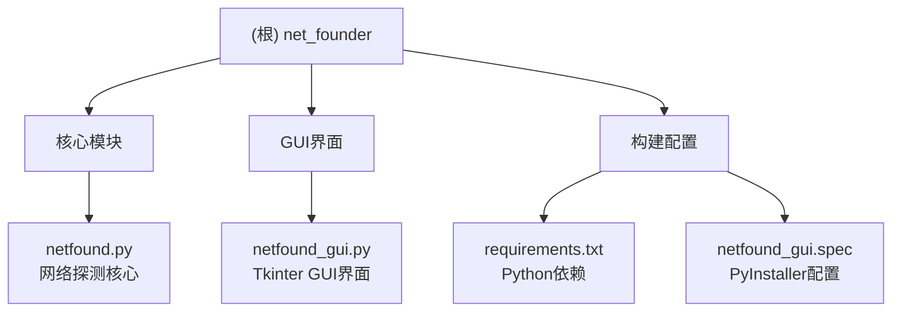

# Net-Founder - 网络探测工具

> 自动化网络设备发现与端口服务检测工具

**项目版本**: 1.0.0 | **最后更新**: 2026-05-11

## 项目愿景

Net-Founder 是一款轻量级的网络探测工具，用于批量扫描 IP 段的存活状态、端口开放情况及常见服务 (HTTP/HTTPS/SSH) 的可用性。适用于运维工程师快速发现网络中的活跃设备及其服务状态。

## 架构总览



## 模块索引

| 模块路径 | 语言 | 职责描述 | 入口文件 |
|----------|------|----------|----------|
| `/` | Python | 网络探测核心逻辑 (端口测试/SSH/PING) | netfound.py |
| `/` | Python | Tkinter GUI 界面与用户交互 | netfound_gui.py |

## 运行与开发

### 环境要求
- Python 3.8+
- 依赖: `requests`, `paramiko`, `pythonping`

### 安装依赖
```bash
pip install -r requirements.txt
```

### 运行方式

**命令行模式 (netfound.py)**:
```bash
python netfound.py
```

**GUI模式 (netfound_gui.py)**:
```bash
python netfound_gui.py
```

### 打包为可执行文件
```bash
# 标准打包
pyinstaller -F netfound_gui.py

# 无控制台打包 (生成纯GUI应用)
pyinstaller --noconsole netfound_gui.py
```

## 测试策略

当前项目无正式测试套件。建议补充:
- 单元测试: 覆盖 `netfound.py` 的各端口测试函数
- 集成测试: 测试 GUI 与核心模块的交互

## 编码规范

- **类型注解**: 使用 Python typing 模块进行类型提示
- **异步处理**: 使用 `asyncio` + `ThreadPoolExecutor` 处理并发扫描
- **错误处理**: 捕获网络异常，避免单点失败中断扫描

## AI 使用指引

### 常见任务

1. **添加新的端口检测**:
   - 在 `netfound.py` 中定义新的 `PortTester` 实例
   - 参考现有实现 (HTTP/HTTPS/SSH)

2. **修改 GUI 布局**:
   - 编辑 `netfound_gui.py` 中的 `MainDialog.__init__` 方法
   - 使用 `ttk` 组件库

3. **扩展 SSH 功能**:
   - 使用 `paramiko.SSHClient` 连接
   - 参考 `ssh_request_cmd()` 函数实现

---

## 变更记录 (Changelog)

| 日期 | 版本 | 变更内容 |
|------|------|----------|
| 2026-05-11 | 1.0.0 | 初始化架构文档，添加模块索引与Mermaid结构图 |
| - | - | 归档版本 |
| - | - | 添加 SSH "Incompatible ssh peer" 错误显示 |
| - | - | 添加 requirements.txt |
| - | - | 添加截图和说明 |
| - | - | 初始版本 |